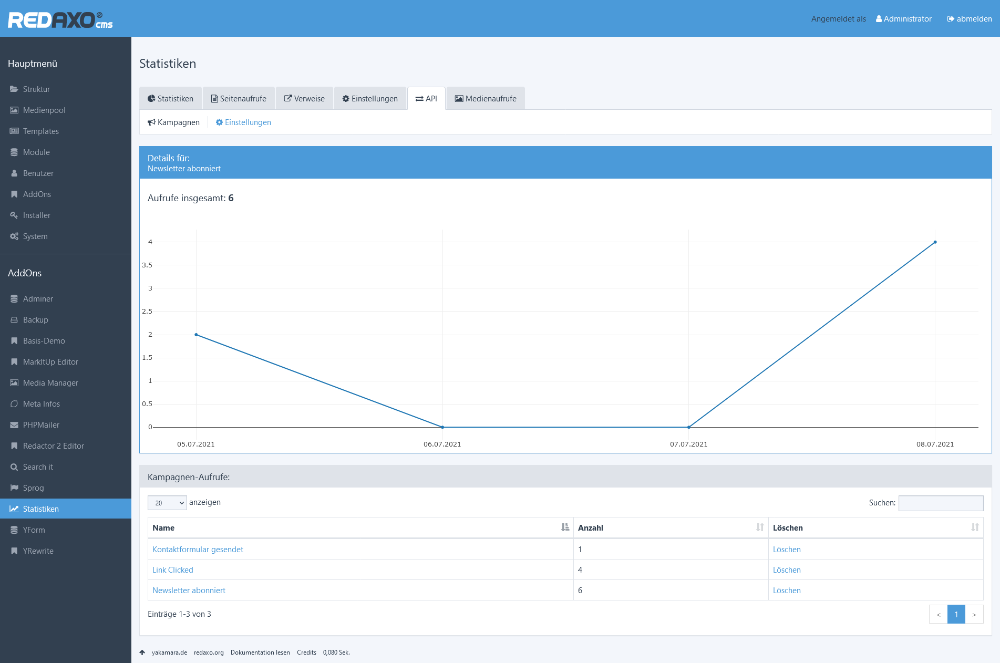
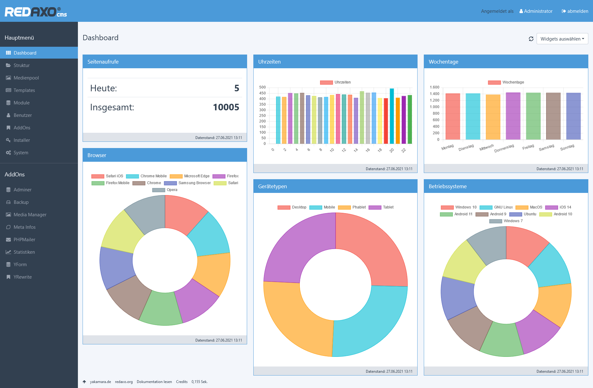

# Analytics Addon für REDAXO CMS

## Work in Progress - nicht für den produktiven Einsatz geeignet

----

## Features:

Dieses Addon stellt im REDAXO CMS eine Besucherzählung bereit.  

Dabei werden folgende Metriken erfasst und optisch dargestellt:  
- Tag des Besuches (Datum und Wochentag)
- Besuchszeit
- Browser
- Gerätetyp
- Betriebssystem
- Gerätemarke und Gerätemodell
- Bots (Crawler etc.)
- Referrer

Dieses Addon arbeitet **OHNE** Cookies und kann somit Datenschutzkonform eingesetzt werden.

Persönlichen Daten (z.B. die IP Adresse des Besuchers) werden nur gehasht gespeichert und können somit nicht ohne großen Aufwand dechiffriert werden.

Die IP Adresse wird genutzt, um ein wiederholtes Aufrufen von Seiten nicht in die Statistik einfließen zu lassen.

## Plugins:

### Medien-Tracking:
Um Aufrufe von Medien (Bilder, Dokumente, etc.) zu loggen muss das Plugin "Media" aktiviert werden.
Dieses kann auf zwei Arten verwendet werden:
1. Alle Medien tracken  
   Dabei werden alle Aufrufe zu Medien in der Statistik erfasst.
   > **Dies wirkt sich sehr negativ auf die Ladezeit der Website aus und sollte nur mit Bedacht genutzt werden!**
2. Medien mittles Media-Manager-Effekt tracken  
   Um gezielt Medien erfassen zu können, kann ein Media-Manager-Effekt genutzt werden.
   Dieser wird einfach als weiterer Effekt hinzugefügt und erfasst dann nur die Medien die tatsächlich für die Statistik interessant sind.


### API (Kampagnen):
Dieses Plugin erlaubt es, einen API Request zu nutzen um im Frontend ein bestimmtes Ereigniss zu tracken (beispielsweise das Anklicken eines Links oder das Absenden eines Formulars).


## Installation:

Das Repository herunterladen und im Ordner `redaxo > src > addons` entpacken.  
Danach den Ordner in `statistics` umbenennen.  


## Einstellungen:
Es können folgende Einstellungen getroffen werden:
- Besuchsdauer, bestimmt innerhalb welches Zeitraumes ein Benutzer nur einmal pro Url erfasst werden soll
- Ignore-Liste für URLs, hier kann eine Reihe an Urls angegeben werden welche nicht in der Statistik erfasst werden sollen
- Ignore-Liste für IPs, hier kann eine Reihe an IP Adressen angegeben werden von denen Besuche nicht erfasst werden sollen


## Beispiele:

### Frontend Counter:
Falls man im Frontend einen Besucher-Counter einfügen möchte klappt das mittles der folgenden Modul-Ausgabe:
```php
<?php
$counter = new stats_visitor_counter();
?>

<p>Besucher: <code><?php echo $counter->get_text() ?></code><p>
```
Der Ausgegebene Text kann dann nach Belieben gestaltet werden.


### Download-Counter:
> Benötigt das Plugin "Media"  

1. Im Media Manager einen neuen Medientyp anlegen mit dem Namen "log"
2. Zu diesem den Effekt "Datei in Statistik loggen" hinzufügen
3. Ein Modul anlegen  
   Eingabe:
   ```
    <label>Downloads:</label>
    REX_MEDIALIST[id="1" widget="1"]
   ```
   Ausgabe:
   ```
    <div class="container">
        <h2>Downloads:</h2>
        <table class="table">
    
        <tr>
            <th>Name</th>
            <th>Link</th>
        </tr>

        <?php
        foreach (explode(',', "REX_MEDIALIST[1]") as $img)
        {
            echo '<tr>';
                echo '<td>'. $img .'</td>';
                echo '<td><a href="'.rex_media_manager::getUrl('log',$img).'">Download</a></td>';
            echo '</tr>';
        }
        ?>
            
        </table>
    </div>
   ```
4. In den Einstellungen des Media-Plugins das tracken aktivieren.
5. Das Beipiel erzeugt dann eine solche Tabelle:  
   
   Klickt der Besucher auf den Link "Download" wird dieser Aufruf in der Statistik gespeichert.


### Kampagnen-Tracking:
Ziel: Das Klicken eines Links im Frontend soll erfasst werden.
> Benötigt das Plugin "API"

1. Ein Modul anlegen
   Eingabe:
   ```html
    <label>Kampagnen-Name:</label>
    <input type="text" name="REX_INPUT_VALUE[1]" value="REX_VALUE[1]">
   ```

   Ausgabe:
   ```html
    <a class="btn btn-primary" onclick="myFunction()" href="http://example.com/">Link</a>

    <script>
    function myFunction() {
        fetch('/?rex-api-call=stats&name=REX_VALUE[1]');
    }
    </script>
   ```


## Preview:

### Startseite des Addons mit den wichtigsten Metriken:


### Seite mit Details über eine URL:


### Statistiken über Medien Aufrufe:


### Verweise:


### API / Kampagnen:



### Integration in das Addon https://github.com/yakamara/dashboard
